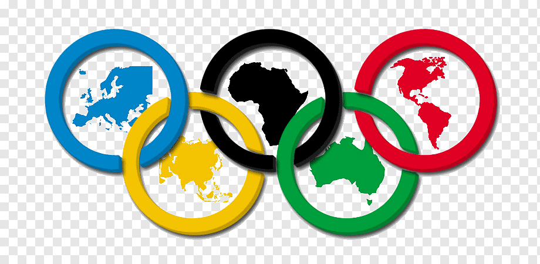

# ETG-Summer-Olympics-Data-Analysis

### SKILL ML AI INTERNSHIP

This project deals with data analysis. In this project some questions of a given dataset .csv file is answered with the help of Python. This project would be a great beginning for 
all those data analysts who want to emerge in this field.

### Files In  This Project

1. Summer.csv - The dataset containing olympics record.
2. Summer.ipynb - The file  containing all the queations related to the project 
3. Summer Olympics Data Analysis.ipynb - The Jupyter Notebook file in which all the questions are solved using Python

### About Author
Hi, I'm Sidharth S Unnithan, a sophomore CSE undergrad at Jyothi Engineering College, Thrissur, Kerala. Keen tech enthusiast and entrepreneur.

### Contact Info

1. Email - sidsunnithan2720@gmail.com
2. Linkedin - https://www.linkedin.com/in/sid2020/
